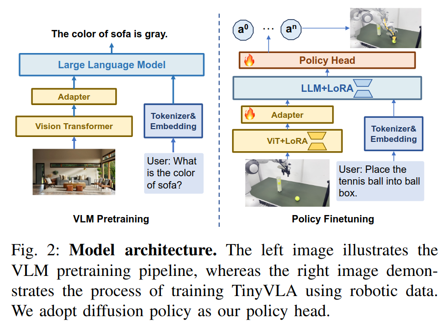

这篇文章本质上希望去加速原OpenVLA并同时保持正确率，那么作者的一个想法就是引入更小的VLM和diffusion-based policy head to predict action **chunk**. 按照其原本的实现，这个推理过程是同步进行的。
###### Structured Input to VLM
参考VLM的工作，作者采用的是结构化的text+image输入
```bash
<|im_start|>system
You are a helpful assistant.
<|im_end|>
<|im_start|>user
cam_high: <image>
cam_left_wrist: <image>
cam_right_wrist: <image>
{instruction}
<|im_end|>
<|im_start|>assistant
```
注意这里robot state没有进入VLM，而是直接作为condition送到action expert里面了
###### A bit about LoRA

```python
import torch
import torch.nn as nn

class LoRALinear(nn.Module):
    def __init__(self, in_features, out_features, rank=8):
        super().__init__()
        
        # 1. The Original Pre-trained Layer (FROZEN)
        self.W0 = nn.Linear(in_features, out_features, bias=False)
        self.W0.weight.requires_grad = False # <--- CRUCIAL STEP
        
        # 2. The LoRA Matrices (TRAINABLE)
        # Matrix A reduces the dimension: (in_features -> rank)
        self.A = nn.Linear(in_features, rank, bias=False)
        self.A.weight.requires_grad = True
        
        # Matrix B expands the dimension back: (rank -> out_features)
        self.B = nn.Linear(rank, out_features, bias=False)
        self.B.weight.requires_grad = True

        # 3. Initialization Trick
        # Initialize B to completely zeros. 
        # This ensures that at step 0, B * A = 0, and the model behaves exactly 
        # like the original pre-trained model.
        nn.init.zeros_(self.B.weight)
        nn.init.kaiming_uniform_(self.A.weight)

    def forward(self, x):
        # Forward pass branches into two parallel paths
        
        # Path 1: The frozen pre-trained weights
        frozen_out = self.W0(x)
        
        # Path 2: The LoRA path (computed as B(A(x)) for efficiency)
        lora_out = self.B(self.A(x))
        
        # Combine them
        return frozen_out + lora_out

# At inference
# Assuming W0 is (d, k), B is (d, r), and A is (r, k)

with torch.no_grad(): # We don't need gradients for this!
    # 1. Multiply B and A to get the delta matrix
    delta_W = torch.matmul(B.weight, A.weight) 
    
    # 2. Add the delta to the original frozen weights
    W0.weight.data += delta_W
```
即实践上是$(W_0+BA)x$ 
